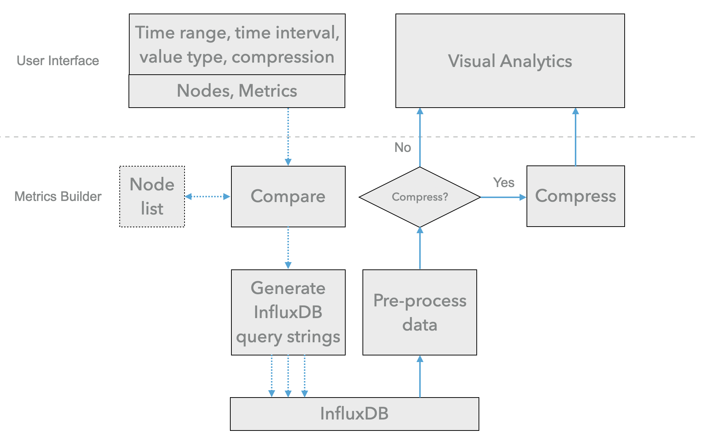

# MetricsBuilder

## Overview

<p align="center">

</p>

**Metrics Builder** acts as a middleware between the consumers (i.e. analytic clients or tools) and the producers (i.e. the databases). As depcited in the figure, its main workflow is as follows. 

1. It receives requests from consumers. The request includes `time range`, `time interval`, `data type` information, if the returned data is `compressed` or not. User can also specify the target `nodes` and `metrics` interested in (This function is still under optimized, you may find it under the **filter** branch. We will merge this function into the master branch once we finish it). The time range represents the window of time for the data that consumers want to access. Time intervals and data types are used to aggregate and downsample time series data. 
2. Metrics Builder compare the specified nodes with the nodelist of the cluster being monitored and then generates the appropriate InfluxDB query strings based on valid nodes and the information specified by the consumer, and then sends queries to InfluxDB and waits for responses. 
3. Metrics Builder then processes data returned from InfluxDB, builds the data in JSON format. It decides whether the JSON data need to be compressed or not. The compression option is set to True by default, which significantly reduces the transmission time.

Metrics Builder API is a OpenAPI-enabled Flask server that is generated by the [OpenAPI Generator](https://openapi-generator.tech) project.

## OpenAPI specification

YAML file `openapi.yaml` is the OpenAPI specification of this API service. It comprises 5 parts: `openapi`, `info`, `servers`, `components`, and `paths`.

`openapi` specifies the version number of OpenAPI specification this document uses. `info` is the metadata of the API service. `servers` specifies connectivity information of the API service. 

`components` are a collection of resuable schemas throughout the API service. In this implementation, we use two schemas, `UnifiedMetrics` and `ErrorMessage`. `UnifiedMetrics` includes `nodes_info`, `jobs_info`, and `time_stamp` fields, representing **node-related metrics**, **job-related metrics**, and **epoch time stamps**, respectively.

`paths` are the reources and method supported by the API service. We only have `get` method in the API.

OpenAPI generator uses `openapi.yaml` as the input, prepares server-side stub using the flask framework in Python.

## Requirements
Python 3.5.2+

## Usage
To run the server, please execute the following from the password directory:

```
pip3 install -r requirements.txt
python3 -m openapi_server
```

and open your browser to here:

```
http://localhost:8080/ui/
```

Your OpenAPI definition lives here:

```
http://localhost:8080/openapi.json
```

To launch the integration tests, use tox:
```
sudo pip install tox
tox
```

## Running with Docker

To run the server on a Docker container, please execute the following from the password directory:

```bash
# building the image
docker build -t openapi_server .

# starting up a container
docker run -p 8080:8080 openapi_server
```