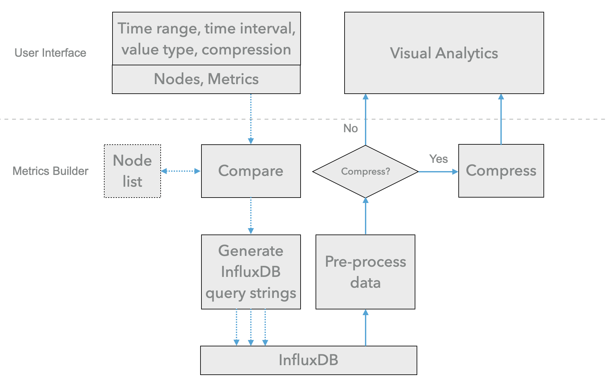

# MetricsBuilder

## Overview

**Metrics Builder** acts as a middleware between the consumers (i.e. analytic clients or tools) and the producers (i.e. the databases). Its provides APIs for [the web applications](https://idatavisualizationlab.github.io/HPCC/) and [the grafana datasource plugin](https://github.com/nsfcac/grafana-plugin), and accelerates the data query performance.

Metrics Builder API is a OpenAPI-enabled Flask server that is generated by the [OpenAPI Generator](https://openapi-generator.tech) project. YAML file `./openapi/openapi.yaml` is the OpenAPI specification of this API service. Users can modify the spec according to their needs. Once `openapi.yaml` is updated, users can run `./openapi/gen.sh` to update the code generated from `openapi.yaml`.


## APIs

#### /metricsbuilder/{partition}: 
**GET** request to query monitoring metrics, job information, etc. for the web applications.

Supported parameters:
- `partition`: the target partition of the HPC cluster; available values are "nocona" and "quanah", two CPU partitions in HPCC at Texas Tech University. Default value is "nocona".
- `start`: start time of the time range.
- `end`: end time of the time range.
- `interval`: time interval for aggregating metrics.
- `aggregation`: aggregation function used for aggregating the metrics of specified time interval. Available values are "min", "max", "mean" and "median". Default value is "max".
- `nodelist`: target nodes in the partition. Default value : 10.101.23.[1-60],10.101.24.[1-60],10.101.25.[1-60],10.101.26.[1-60]
- `metrics`: metrics of interested. Available values are "System Power-iDRAC", "CPU Power-iDRAC", "Memory Power-iDRAC", "Fan Sensor-iDRAC", "Temperature Sensor-iDRAC", "CPU Usage-iDRAC", "Memory Usage-Slurm", "NodeJobs Correlation-Slurm", "Jobs Info-Slurm".
- `compression`: return compressed data.


## Requirements
Python 3.5.2+

## Usage
To run the server, please execute the following from the password directory:

```
pip3 install -r requirements.txt
python3 mbapi.py
```

and open your browser to here:

```
http://localhost:8080/ui/
```

Your OpenAPI definition lives here:

```
http://localhost:8080/openapi.json
```

To launch the integration tests, use tox:
```
sudo pip install tox
tox
```


<!-- # MetricsBuilder

## Overview

<p align="center">

</p>

**Metrics Builder** acts as a middleware between the consumers (i.e. analytic clients or tools) and the producers (i.e. the databases). As depcited in the figure, its main workflow is as follows. 

1. It receives requests from consumers. The request includes `time range`, `time interval`, `data type` information, if the returned data is `compressed` or not. User can also specify the target `nodelist` and `metrics`; these two fields are not required; if not specified, Metrics Builder will get all nodes and all available metrics based on configuration. The time range represents the window of time for the data that consumers want to access. Time intervals and data types are used to aggregate and downsample time series data. 
2. Metrics Builder compare the specified nodes with the nodelist of the cluster being monitored and then generates the appropriate InfluxDB query strings based on valid nodes and the information specified by the consumer, and then sends queries to InfluxDB and waits for responses. 
3. Metrics Builder then processes data returned from InfluxDB, builds the data in JSON format. It decides whether the JSON data need to be compressed or not. The compression option is set to True by default, which significantly reduces the transmission time.

The performance behavior and experience we gained through the development of MetricsBuilder can be found on the wiki page [Performance Optimization](https://github.com/nsfcac/MetricsBuilder/wiki/Performance-Optimization).

Metrics Builder API is a OpenAPI-enabled Flask server that is generated by the [OpenAPI Generator](https://openapi-generator.tech) project.


## OpenAPI specification

YAML file `openapi.yaml` is the OpenAPI specification of this API service. It comprises 5 parts: `openapi`, `info`, `servers`, `components`, and `paths`.

`openapi` specifies the version number of OpenAPI specification this document uses. `info` is the metadata of the API service. `servers` specifies connectivity information of the API service. 

`components` are a collection of resuable schemas throughout the API service. In this implementation, we use two schemas, `UnifiedMetrics` and `ErrorMessage`. `UnifiedMetrics` includes `nodes_info`, `jobs_info`, and `time_stamp` fields, representing **node-related metrics**, **job-related metrics**, and **epoch time stamps**, respectively.

`paths` are the reources and method supported by the API service. We only have `get` method in the API.

OpenAPI generator uses `openapi.yaml` as the input, prepares server-side stub using the flask framework in Python.

## Requirements
Python 3.5.2+

## Usage
To run the server, please execute the following from the password directory:

```
pip3 install -r requirements.txt
python3 -m openapi_server
```

and open your browser to here:

```
http://localhost:8080/ui/
```

Your OpenAPI definition lives here:

```
http://localhost:8080/openapi.json
```

To launch the integration tests, use tox:
```
sudo pip install tox
tox
```

## Running with Docker

To run the server on a Docker container, please execute the following from the password directory:

```bash
# building the image
docker build -t openapi_server .

# starting up a container
docker run -p 8080:8080 openapi_server
``` -->